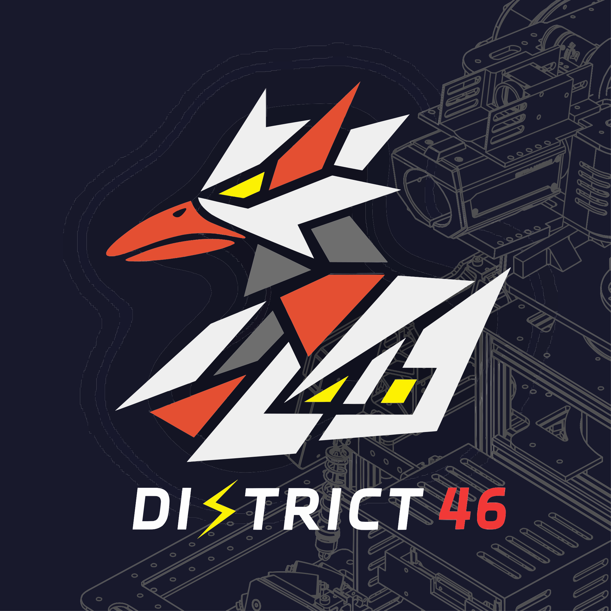

# DT-46-KielasVison
梓喵-铭

<br>

<br>我的爱如潮水，you 然，我已无法再与它 apart

## **[技术文档-GitHub](https://github.com/DT46-Vision/RM_Kielas_Vision_doc.git)**
## **[训练代码-GitHub](https://github.com/DT46-Vision/RM_KielasVison_MLP_Training.git)**

### DT-46-KielasVison-Armor_type_definition
| 编号 | 含义             | 序号 |
|------|------------------|------|
| B1   | 蓝方1号 装甲板   | 0    |
| B2   | 蓝方2号 装甲板   | 1    |
| B3   | 蓝方3号 装甲板   | 2    |
| B4   | 蓝方4号 装甲板   | 3    |
| B5   | 蓝方5号 装甲板   | 4    |
| B7   | 蓝方哨兵 装甲板   | 5    |
| R1   | 红方1号 装甲板   | 6    |
| R2   | 红方2号 装甲板   | 7    |
| R3   | 红方3号 装甲板   | 8    |
| R4   | 红方4号 装甲板   | 9    |
| R5   | 红方5号 装甲板   | 10   |
| R7   | 红方哨兵 装甲板   | 11   |

---
# 关于串口定位
- 本自瞄需要使用两个串口，需要定向映射
1. 获取串口信息
    ```bash
    udevadm info -a -n /dev/ttyACM0 | grep -E '{idVendor}|{idProduct}|{serial}'
    ```

    - imu 串口 
        ```bash
            ATTRS{idProduct}=="ffff"
            ATTRS{idVendor}=="ffff"
            ATTRS{serial}=="2025021200"
            ATTRS{idProduct}=="0002"
            ATTRS{idVendor}=="1d6b"
            ATTRS{serial}=="0000:00:14.0"
        ```
    - 下位机通信串口
        ```bash
            ATTRS{idProduct}=="55d3"
            ATTRS{idVendor}=="1a86"
            ATTRS{serial}=="5909029513"
            ATTRS{idProduct}=="0002"
            ATTRS{idVendor}=="1d6b"
            ATTRS{serial}=="0000:00:14.0"
        ```
    - 这里需要使用的是**最上面的一组（第一组）**数据
    - 记下它的 **idVendor**、**idProduct** 和 **serial**

2. 编写通用的 udev 规则
    a. 创建或编辑规则文件：
    ```bash
        sudo nano /etc/udev/rules.d/99-fixed-serial.rules
    ```
    b. 编写规则：
    ```bash
        ACTION=="add", KERNEL=="ttyACM*", ATTRS{idVendor}=="ffff", ATTRS{idProduct}=="ffff", ATTRS{serial}=="2025021200", SYMLINK+="ttyPortIMU", MODE="0666"
        ACTION=="add", KERNEL=="ttyACM*", ATTRS{idVendor}=="1a86", ATTRS{idProduct}=="55d3", ATTRS{serial}=="5909029513", SYMLINK+="ttyPortMCU", MODE="0666"
    ```
3. 重新加载规则
    1. 配置完成后，运行以下命令：
    ```bash
        sudo udevadm control --reload-rules
        sudo udevadm trigger
    ```
    2. 确保规则已重新加载
        - 以防万一，再执行一次重载命令：
        ```Bash
            sudo udevadm control --reload-rules
        ```
    3. 进行物理重插拔（关键步骤）
        - 不要只依靠重启或软件 trigger，请手动把这两个串口的 USB 线从电脑上拔下来，等待几秒钟，然后再重新插上去。
        （对于 ttyACM 类的复合 USB 设备，真实的物理插拔往往是让 udev 重新分配节点最有效的方式）。

    4. 验证结果
        - 设备重新插好后，运行以下命令查看软链接是否成功生成：

        ```Bash
            ls -l /dev/ttyPort*
            # 或者 ls /dev/tty*
        ```
        - 如果成功，你应该会看到类似这样的输出（它会明确指出软链接指向了哪个原生节点）：

        ```bash
        lrwxrwxrwx 1 root root 7 3月 19 05:20 /dev/ttyPortIMU -> ttyACM1
        lrwxrwxrwx 1 root root 7 3月 19 05:20 /dev/ttyPortMCU -> ttyACM0
        ```